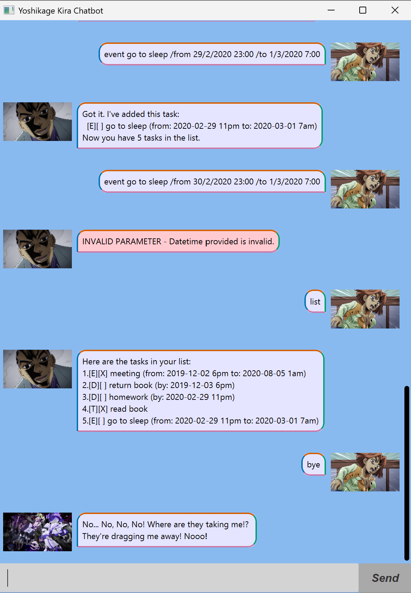

# Yoshikage Kira User Guide

Have you wondered what bites the dust felt like?

Introducing JoJo's Bizzare Adventure antagonist Yoshikage Kira 💀. Now he helps you to manage your tasks as a chatbot. Ain't that wacky?

<center></center>

---

## 📖 Table of Contents

1. [Quick Start](#-quick-start)
2. [Usage](#-usage)
   - [Add Tasks: `todo`, `deadline`, `event`](#add-tasks-todo-deadline-event)
   - [List Tasks: `list`](#list-tasks-list)
   - [Delete Tasks: `delete`](#delete-tasks-delete)
   - [Find Tasks: `find`](#find-tasks-find)
   - [Mark Tasks: `mark`](#mark-tasks-mark)
   - [Unmark Tasks: `unmark`](#unmark-tasks-unmark)
   - [Sort Tasks: `sort`](#sort-tasks-sort)
   - [Clear Task List: `clear`](#clear-task-list-clear)
   - [Exit Program: `bye`](#exit-program-bye)
3. [FAQ](#-faq)
4. [Known Issues](#-known-issues)

---

## 🚀 Quick Start

1. Check that you have **Java 17 or above** installed, using the following command:
   
   ```bash
   java -version
   ```

2. Download the latest `.jar` file from [here](https://github.com/DenseLance-alt/ip/releases/).

3. Run the chatbot using the following command:
   
   ```bash
   java -jar chatbot.jar
   ```

---

## 📚 Usage

### Add Tasks: `todo`, `deadline`, `event`

Adds a task to the task list.

Format:

* `todo <task-name>`

* `deadline <task-name> /by <start-datetime>`

* `event <task-name> /from <start-datetime> /to <end-datetime>`

Example:

* `todo read book`

* `deadline return book /by 3/12/2019 18:00`

* `event meeting with friends /from 2/12/2019 18:00 /to 5/8/2020 1:00`

Expected Output:

* ```
  Got it. I've added this task:
    [T][] read book
  Now you have 1 tasks in the list.
  ```

* ```
  Got it. I've added this task:
    [D][] return book (by: 2019-12-03 6pm)
  Now you have 2 tasks in the list.
  ```

* ```
  Got it. I've added this task:
    [E][] meeting with friends (from: 2019-12-02 6pm to: 2020-08-05 1am)
  Now you have 3 tasks in the list.
  ```

<br>

### List Tasks: `list`

Shows all tasks in the task list.

Format: `list`

<br>

### Delete Tasks: `delete`

Removes a task from the task list.

Format: `delete <index>`

* Deletes the task at the specified `<index>`.

* The index refers to the index number shown in the displayed task list.

* The index must be a **positive integer** 1, 2, 3, …

Example:

- `delete 3`

Expected Output:

* ```
  Noted. I've removed this task:
    [E][] meeting with friends (from: 2019-12-02 6pm to: 2020-08-05 1am)
  Now you have 2 tasks in the list.
  ```

<br>

### Find Tasks: `find`

Finds all tasks that contain a specific keyword.

Format: `find <keyword>`

- The search is case-insensitive, e.g. `book` will match `Book`.

- Only the task name will be searched.

Example:

- `find book`

Expected Output:

* ```
  Here are the matching tasks in your list:
    1.[T][] read book
    2.[D][] return book
  ```

<br>

### Mark Tasks: `mark`

Marks a task as complete.

Format: `mark <index>`

Example:

* `mark 1`

Expected Output:

* ```
  Nice! I've marked this task as done:
    [T][X] read book
  ```

<br>

### Unmark Tasks: `unmark`

Marks a task as incomplete.

Format: `unmark <index>`

Example:

* `unmark 1`

Expected Output:

* ```
  OK, I've marked this task as not done yet:
    [T][] read book
  ```

<br>

### Sort Tasks: `sort`

Sorts the task list by chronological order.

Format: `sort`

* Events are sorted using its start date.

* To do tasks will only come after deadlines and events.

* Task name is used to arrange two tasks with the same date.

<br>

### Clear Task List: `clear`

Deletes all tasks in the task list.

Format: `clear`

<br>

### Exit Program: `bye`

Exits the program.

Format: `bye` 

---

## ❓ FAQ

**Q: Where are my tasks saved at?**

A: `Yoshikage Kira` saves your tasks in a local file at `./temp/tasks.txt`, so that you can get them back even after exiting the app.

**Q: What happens if I delete my task file?**

A: `Yoshikage Kira` will create a brand new task file just for you! Unfortunately, all of your previous entries will be lost.

---

## 🛠 Known Issues

1. If access control for the directory `temp` or the file `tasks.txt` does not allow read and write, `Yoshikage Kira` will prevent you from executing most commands and responds with a `WARNING` message.

---